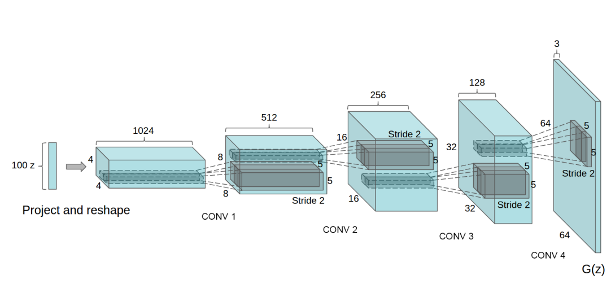

This Repository contains a code to a model to train it on a dataset like AnimeFacesDataset. I've implemented DCGAN from the [original paper](https://arxiv.org/pdf/1511.06434.pdf) to generate images. I've implemented 4 similar 2-dimensional convolutions for downsampling image from 64 to 1 as discriminator and 4 similar 2-dimensional convolutions for upsampling in generator. Generator and Discriminator have approximately 10M params. All Hyperparameters were taken from paper.

# Generator architecture

# Model Evolution
